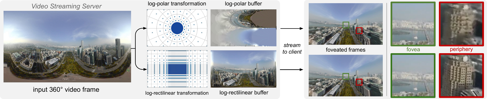

<!-- <div style="display: flex; flex-direction: row">
<a href="https://davidl.me" style="margin-left:1rem; flex-grow: 1;">David Li</a>
<a href="https://duruofei.com" style="margin-left:1rem; flex-grow: 1;">Ruofei Du</a>
<a href="https://github.com/adharsh" style="margin-left:1rem; flex-grow: 1;">Adharsh Babu</a>
<a href="https://kamibrumi.github.io/" style="margin-left:1rem; flex-grow: 1;">Camelia Brumar</a>
<a href="http://www.cs.umd.edu/~varshney/" style="margin-left:1rem; flex-grow: 1;">Amitabh Varshney</a>
</div> -->
## Teaser
</img>

## Downloads

<div style="display: flex; text-align:center; flex-direction: row;">
<div style="margin:1rem; flex-grow: 1;"><a href="#"><br><label>Paper (Coming Soon)</label></a><br></div>
<div style="margin:1rem; flex-grow: 1;"><a href="#"><br>Supplementary (Coming Soon)</a></div>
<div style="margin:1rem; flex-grow: 1;"><a href="#"><br>Code (Coming Soon)</a></div>
</div>

## Video
<iframe width="560" height="315" src="https://www.youtube.com/embed/AjSuUTvQnFg" frameborder="0" allow="accelerometer; autoplay; clipboard-write; encrypted-media; gyroscope; picture-in-picture" allowfullscreen></iframe>

## Abstract
With the rapidly increasing resolutions of 360° cameras, head-mounted displays, and live-streaming services, streaming high-resolution panoramic videos over limited-bandwidth networks is becoming a critical challenge. Foveated video streaming can address this rising challenge in the context of eye-tracking-equipped virtual reality head-mounted displays. However, conventional log-polar foveated rendering suffers from a number of visual artifacts such as aliasing and flickering. In this paper, we introduce a new log-rectilinear transformation that incorporates summed-area table for filtering reduction and off-the-shelf video codecs to enable foveated streaming of 360° videos suitable for VR headsets with built-in eye-tracking. To validate our approach, we build a client-server system prototype for streaming 360° videos which leverages parallel algorithms over real-time video transcoding. We conduct quantitative experiments on an existing 360° video dataset and observe that the log-rectilinear transformation paired with summed-area table filtering heavily reduces flickering compared to log-polar subsampling while also yielding an additional 11% reduction in bandwidth usage.


## Citation
```
@ARTICLE{li2021logrectilinear,
  author= {David Li and Ruofei Du and Adharsh Babu and Camelia D. Brumar and Amitabh Varshney},
  journal={IEEE Transactions on Visualization and Computer Graphics},
  title={A Log-Rectilinear Transformation for Foveated 360-degree Video Streaming},
  year={2021},
  volume={},
  number={},
  pages={},
  doi={}
}
```
