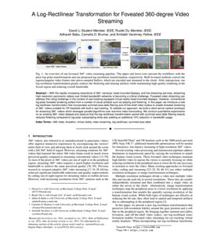
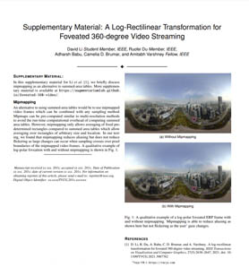
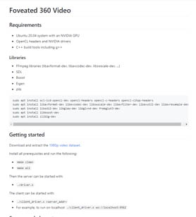
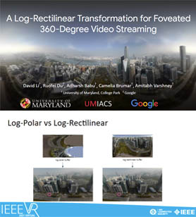

<iframe width="560" height="315" src="https://www.youtube.com/embed/AjSuUTvQnFg" frameborder="0" allow="accelerometer; autoplay; clipboard-write; encrypted-media; gyroscope; picture-in-picture" allowfullscreen style="max-width: 100%; position: relative; left: 50%; transform: translateX(-50%);"></iframe>

## Abstract

[](https://duruofei.com/papers/Li_ALog-RectilinearTransformationForFoveated360-DegreeVideoStreaming_TVCG2021.pdf)

With the rapidly increasing resolutions of 360° cameras, head-mounted displays, and live-streaming services, streaming high-resolution panoramic videos over limited-bandwidth networks is becoming a critical challenge. Foveated video streaming can address this rising challenge in the context of eye-tracking-equipped virtual reality head-mounted displays. However, conventional log-polar foveated rendering suffers from a number of visual artifacts such as aliasing and flickering. In this paper, we introduce a new log-rectilinear transformation that incorporates summed-area table filtering and off-the-shelf video codecs to enable foveated streaming of 360° videos suitable for VR headsets with built-in eye-tracking. To validate our approach, we build a client-server system prototype for streaming 360° videos which leverages parallel algorithms over real-time video transcoding. We conduct quantitative experiments on an existing 360° video dataset and observe that the log-rectilinear transformation paired with summed-area table filtering heavily reduces flickering compared to log-polar subsampling while also yielding an additional 11% reduction in bandwidth usage.

## Downloads

<div style="display: flex; text-align:center; flex-direction: row; flex-wrap: wrap;">
<div style="margin:1rem; flex-grow: 1;"><a href="https://research.google/pubs/pub49851.pdf"><br><label>Paper</label></a><br></div>
<div style="margin:1rem; flex-grow: 1;"><a href="resources/VR2021_LogRectilinear_Supplementary.pdf"><br>Supplementary</a></div>
<div style="margin:1rem; flex-grow: 1;"><a href="https://github.com/AugmentariumLab/foveated-360-video"><br>Code</a></div>
<div style="margin:1rem; flex-grow: 1;"><a href="https://docs.google.com/presentation/d/15iIS2_9XapnSUtHnTNXNibJ7aeYD9ZYEnJqey0AlB88"><br>Slides</a></div>
</div>

## Citation

```bibtex
@article{Li2021LogRectilinear,
  author={Li, David and Du, Ruofei and Babu, Adharsh and Brumar, Camelia D. and Varshney, Amitabh},
  journal={IEEE Transactions on Visualization and Computer Graphics},
  title={A Log-Rectilinear Transformation for Foveated 360-degree Video Streaming},
  year={2021},
  volume={27},
  number={5},
  pages={2638-2647},
  doi={10.1109/TVCG.2021.3067762}
}
```

David Li, Ruofei Du, Adharsh Babu, Camelia Brumar, and Amitabh Varshney. 2021. A Log-Rectilinear Transformation for Foveated 360-Degree Video Streaming. IEEE Transactions on Visualization and Computer Graphics, 27(5), 2638-2647. DOI: <https://doi.org/10.1109/TVCG.2021.3067762>
